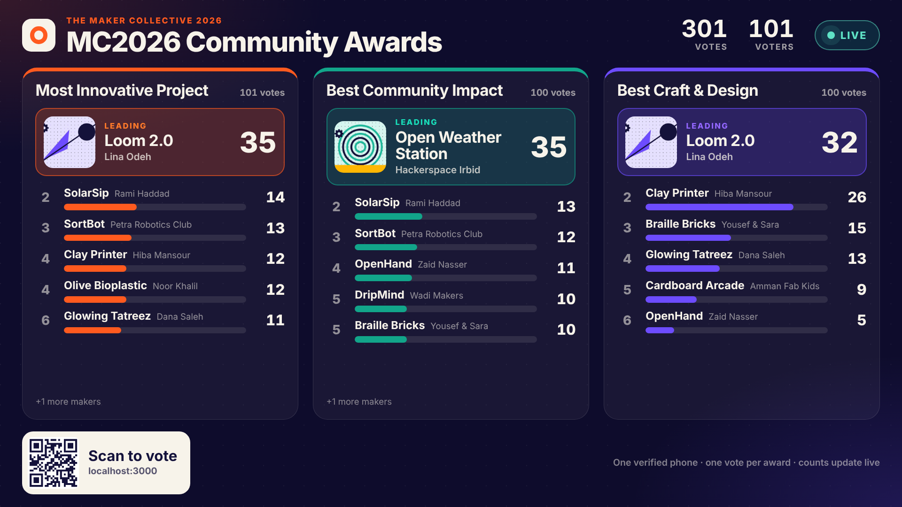
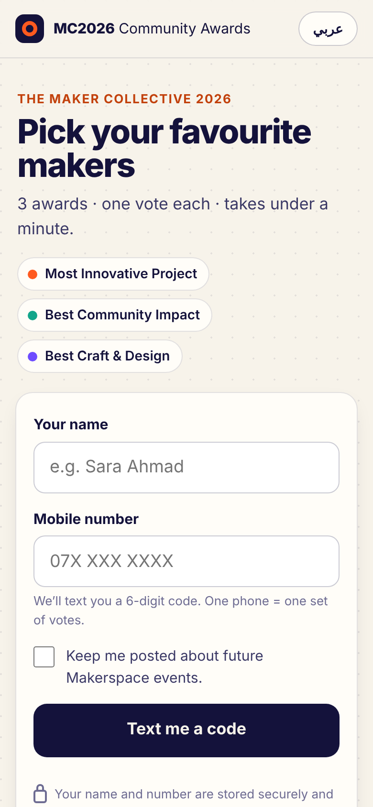
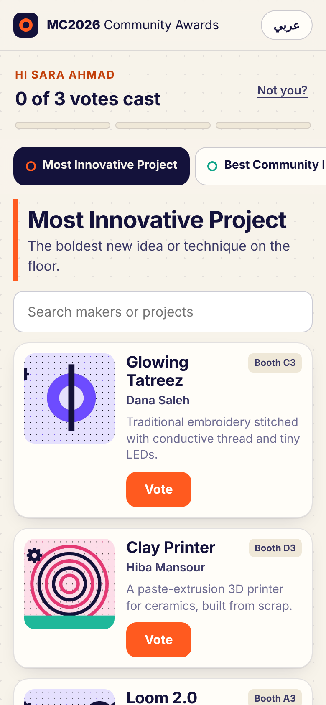
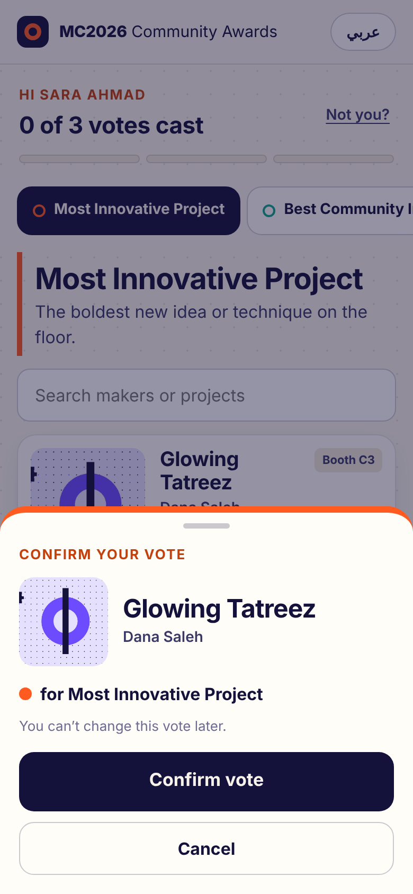
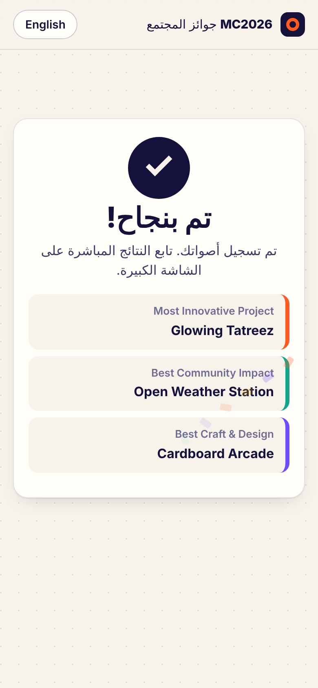
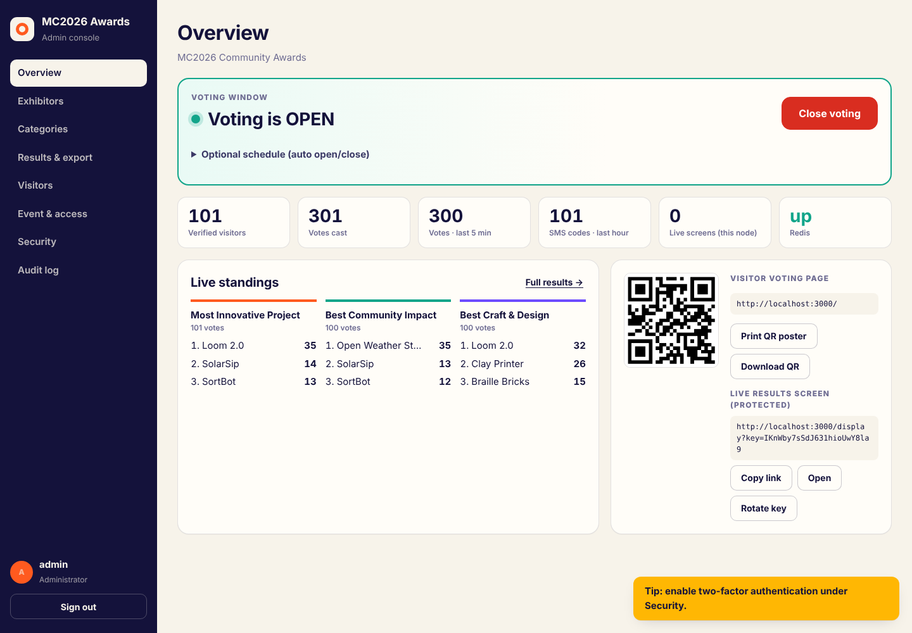

# MC2026 Community Awards — Digital Voting System

On-site, SMS-verified voting for the **Maker Collective 2026** community awards: visitors scan a QR code, verify their phone with a one-time SMS code, cast one vote in each award category, and watch the standings update live on the big screen.

**Stack:** NestJS 11 (TypeScript) · React 19 + Vite · PostgreSQL 16 · Redis (optional) · Docker



<p>
   
</p>



| Visitor page `/` | Live results `/display` | Admin console `/admin` |
|---|---|---|
| Mobile, English/Arabic, QR → name + phone → SMS code → vote in each category | TV layout, real-time (SSE), protected, "Scan to vote" QR | Exhibitors, categories, open/close, access rules, export, MFA |

## Repository layout

```
backend/    NestJS API — modules, guards, DTOs, TypeORM entities + migration, Jest tests, seed data
frontend/   React SPA (Vite + TypeScript) — visitor page, TV dashboard, admin console
scripts/    simulate.js (demo traffic) · loadtest.js (1,000-user load test)
deploy/     nginx.conf (load balancer, SSE-aware)
docs/       write-up, architecture, ERD, DFD, security, design decisions, deployment, load-test results
Dockerfile  one image: builds React, builds Nest, Nest serves the React app
```

## Quick start

**Docker (everything included):**
```bash
cp .env.example .env        # set APP_SECRET, POSTGRES_PASSWORD, ADMIN_PASSWORD, PUBLIC_URL
docker compose up -d --build  # builds app, starts DB/Redis/nginx, runs seed data once
```
The seed job loads fake categories and teams only when the database has no exhibitors yet. To wipe and reload demo data later, run `docker compose run --rm seed node dist/cli/seed.js --force`.

**Local development** (Node 20+, PostgreSQL; Redis optional):
```bash
createdb mc2026
# API
cd backend
npm install
cat > .env <<'EOF'
DATABASE_URL=postgres://localhost:5432/mc2026
APP_SECRET=local-dev-secret-change-me-0123456789
OTP_DEV_ECHO=true
EOF
npm run build && npm run seed && npm start        # http://localhost:3000  (admin / admin12345 in dev)
# React (second terminal)
cd frontend && npm install && npm run dev         # http://localhost:5173 — proxies /api to :3000
```
For a single-port setup, run `npm run build` in `frontend/` — the API then serves the React app itself on :3000.

With `OTP_DEV_ECHO=true` (ignored in production) the SMS code is shown on screen, so the full flow works without an SMS gateway.

Then in **/admin**: Overview → **Open voting** → open the **display link** on a TV → scan the QR with a phone.

## Pitch-day demo script (≈6 min)

1. **Admin** (laptop): show exhibitors with photos & categories; add one live with a photo. Open the live screen link on the projector.
2. **Overview → Open voting.** Show the QR poster.
3. **Phone** (on stage, mirrored): scan → switch to Arabic and back → name + number → code → vote in each category → confetti. The projector updates within a second.
4. **Anti-fraud**: try a 2nd vote in the same category (blocked, shows "you voted for…"); in *Event & access* switch to *Wi-Fi only* and remove the venue range → the phone is refused as off-site; restore.
5. **Scale**: `node scripts/simulate.js 200 20` — the dashboard animates as 200 visitors vote; mention the 1,000-user load-test numbers.
6. **Close voting** → screen flips to *Final results* with winners → **Export CSV**. Show two-factor login and the audit log.

## Requirement traceability

| # | Requirement | Where |
|---|---|---|
| F1 | Exhibitor listing with photo, name, description, category | `frontend/src/vote/Ballot.tsx` — cards, category tabs, search |
| F2 | One selection per category | Ballot UI + DB `UNIQUE(visitor_id, category_id)` |
| F3 | Confirmation + which categories are done | Confirm sheet, toast, progress meter, ticked tabs, summary |
| F4 | Mobile-friendly via QR | Mobile-first page; QR on admin overview, printable poster, and on the TV |
| F5 | No password — name + phone | `Signup.tsx` → `POST /api/public/otp/request` |
| F6 | SMS OTP before voting | `VisitorService.requestOtp/verifyOtp`, pluggable `SmsService` |
| F7 | Live per-category leaderboard | `@Sse` stream in `DisplayController` → `DisplayPage.tsx` |
| F8 | Big-screen layout | Viewport-scaled TV design, high contrast |
| F9 | Exhibitor management + photos + categories | `CatalogService` + Admin → Exhibitors / Categories |
| F10 | Open/close voting | Admin → Overview (manual + schedule); enforced in `VisitorService.assertCanVote` |
| F11 | On-site restriction (IP range / location) | `AccessService` + Admin → Event & access |
| F12 | One verified phone = one vote per category | OTP + normalised phone HMAC + DB constraints (race-tested) |
| F13 | Export final counts | CSV / JSON export (`ReportsController`) |
| F14 | Securely store visitor name + phone | AES-256-GCM at rest, HMAC lookup, masked UI, audited export |
| NFR | 1,000 users, no SPOF, stateless, portable, documented | Load test, Redis-optional design, Docker, `docs/` |

## Documentation

| Document | Contents |
|---|---|
| [Technical write-up](docs/TECHNICAL_WRITEUP.md) | Architecture, stack, access control & anti-fraud, deployment, scaling evidence |
| [Architecture](docs/ARCHITECTURE.md) | Components, code layout, sequence diagrams, statelessness, failure modes |
| [ERD](docs/ERD.md) | Data model and database-enforced rules |
| [DFD](docs/DFD.md) | Context + level-1 data flows, personal-data flow |
| [Security](docs/SECURITY.md) | Authentication, authorization matrix, anti-fraud layers, privacy, pilot checklist |
| [Design decisions](docs/DESIGN_DECISIONS.md) | Why each major choice was made |
| [Deployment](docs/DEPLOYMENT.md) | Docker / bare metal / cloud, venue network setup, event-day runbook |
| [Load-test results](docs/loadtest-results.json) | Raw output of `scripts/loadtest.js` |

## Commands

| Where | Command | What it does |
|---|---|---|
| backend | `npm run build && npm start` | Build and run the API (migrations apply automatically) |
| backend | `npm run seed [-- --force]` | Load mock categories + 22 fake teams/projects, with artwork for the first 12 |
| backend | `npm run create-admin -- <user> <password> [admin\|viewer]` | Create/reset an admin account |
| backend | `npm test` | 30 Jest tests: unit + Supertest end-to-end against real PostgreSQL (`TEST_DATABASE_URL`) |
| frontend | `npm run dev` / `npm run build` | Vite dev server / production build |
| root | `node scripts/simulate.js [visitors] [concurrency]` | Realistic demo traffic through the full OTP flow |
| root | `node scripts/loadtest.js [visitors] [concurrency] [baseUrls]` | 1,000-user load test with correctness and live fan-out checks |

## Notes

- Category names and exhibitors in the seed are **placeholders** (spec §6) — rename/replace them in the admin console.
- Brand colours/fonts are an original placeholder palette; swap in the official CPF Makerspace guidelines via `frontend/src/styles/brand.css`.
- Production checklist before the live pilot: [`docs/SECURITY.md` §6](docs/SECURITY.md#6-before-the-live-pilot--checklist).
