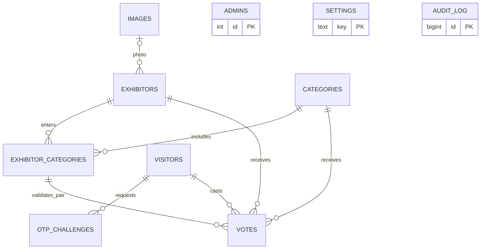
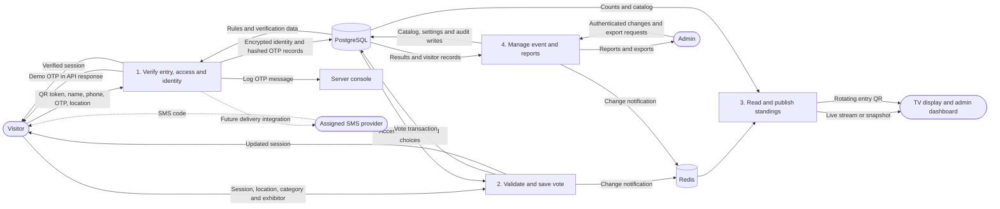

# Maker Collective 2026 — Digital Voting System

On-site voting with phone verification, an admin console, and live results for the venue screen.

## Features

- **Visitor voting:** exhibitor photos, descriptions, category browsing, maker/project search, confirmation and progress; one vote per verified phone per category.
- **Venue access:** rotating QR entry, configurable Wi-Fi/IP and GPS checks, and a blocked-attempt counter.
- **Phone verification:** console OTP demo with expiry, resend cooldown and attempt limits; real SMS delivery is pending an assigned provider.
- **Admin console:** manage categories, exhibitors and photos; configure access, open/close voting, schedule in Amman time, and announce winners.
- **Live results:** protected TV display, live updates with polling fallback, rotating voting QR, and CSV/JSON exports.
- **Security:** optional admin MFA, AES-256-GCM encryption of stored names/phones, database duplicate prevention, audit log, and transactional results reset. Authorized visitor exports are decrypted by the backend and audited.
- **English / Arabic:** remembered language selection and RTL layouts across admin, visitor and results pages.
- **HTTPS venue access:** local HTTPS gateway for phone GPS, HTTP-to-HTTPS redirects and original client-IP forwarding.

## Languages and frameworks

| Choice | Why |
|---|---|
| **TypeScript / JavaScript** | Type checking across frontend/backend; JavaScript for deployment and demo scripts. |
| **React + Vite** | Reusable interfaces, hot reload, and optimized production builds. |
| **NestJS on Node.js** | Organized API modules, request validation, authentication guards and live event streams. |
| **PostgreSQL + SQL / TypeORM** | Durable data, migrations, transactions and constraints that prevent duplicate votes. |
| **Redis** | Shared rate limits and notifications between app replicas. |
| **HTML / CSS** | Responsive mobile/TV layouts and RTL styling. |
| **Docker Compose + nginx** | Reproducible setup, reverse proxy and multiple application replicas. |

## Run locally

Install **Docker / Docker Compose, Node.js 20+, GNU Make and OpenSSL**. Run the commands in a POSIX-compatible shell (Linux/macOS, or Git Bash/WSL on Windows). On first setup, copy `.env.example` to `.env`, then set:

```dotenv
APP_SECRET=<random secret of at least 32 characters>
POSTGRES_PASSWORD=<database password>
ADMIN_USERNAME=admin
ADMIN_PASSWORD=<strong password of at least 10 characters>
NODE_ENV=development
COOKIE_SECURE=true
SMS_PROVIDER=console
OTP_DEV_ECHO=true
```

```sh
make
```

This starts Docker and the HTTPS gateway on port **8443** by default. Keep the terminal open and use the printed HTTPS address, adding `/admin` to sign in. The gateway uses a local self-signed certificate; follow the **[HTTPS/LAN guide](docs/LAN_EVENT_SETUP.md)** for first-time certificate setup. For automatic link detection, leave both `PUBLIC_URL` and the admin's saved public address empty; otherwise set the override to the correct HTTPS address.

The configured admin is created only when no admin account exists; changing `.env` does not reset an existing password. Review the seeded demo categories/exhibitors, configure venue access and open voting. Open the display link from the dashboard; visitors scan its QR to vote. With the demo settings above, OTP codes are logged to the console and returned by the API for display on screen.

Use the gateway's printed address for every page:

- Voting: `https://<server-ip>:8443/`
- Admin: `https://<server-ip>:8443/admin`
- Results: open the protected display link from the admin dashboard on the same HTTPS address.

For deployment, configure the assigned SMS provider and production settings: **[deployment guide](docs/DEPLOYMENT.md)**. Seeded names and event dates must be confirmed before the event.

## ERD — database relationships



PostgreSQL enforces unique phone hashes, one vote per visitor/category, and valid exhibitor/category pairs. Admins, settings and audit records are independent tables; audit actors are text, not foreign keys. **[Detailed ERD and fields](docs/ERD.md)**.

## DFD — main data flows



**[Detailed DFD](docs/DFD.md)** · **[Architecture](docs/ARCHITECTURE.md)**
