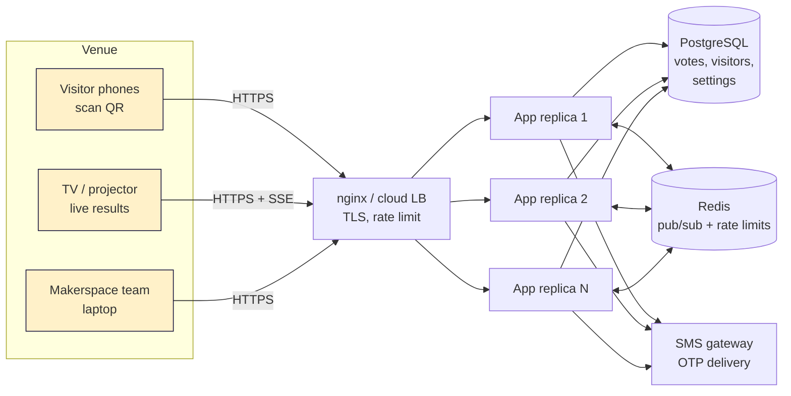
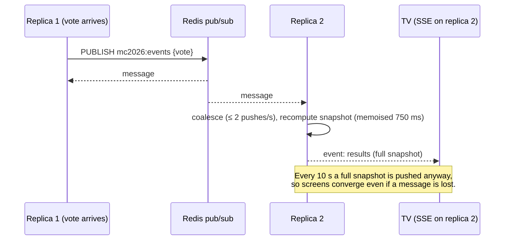

# Architecture

## 1. Overview

The MC2026 voting system is a **NestJS** (TypeScript) API with a **React** single-page front-end (three interfaces: visitor, TV, admin), backed by PostgreSQL (source of truth) and Redis (optional accelerator). Every app instance is **stateless**, so any number of identical replicas can run behind a load balancer.



| Component | Technology | Responsibility |
|---|---|---|
| Visitor page `/` | React 19 (lazy-loaded route) | Mobile voting flow, EN/AR, retries on flaky Wi-Fi |
| Live dashboard `/display` | React + Server-Sent Events | Big-screen standings, protected by display key |
| Admin console `/admin/*` | React + React Router | Exhibitors, categories, voting window, access rules, export, MFA |
| API | NestJS 11 (Express adapter), TypeORM 0.3 | Modules, guards, DTO validation, anti-fraud, tallies, SSE |
| PostgreSQL 16 | Primary store | All data and **all settings** (spec §6: database-driven) |
| Redis 7 | Optional | Cross-replica pub/sub for live updates; shared rate-limit counters; short caches |
| SMS provider | Pluggable (console / Twilio / generic HTTP) | Delivers OTP codes; chosen by CPF before the pilot |

## 2. Code layout

```
backend/                     NestJS 11 (TypeScript) + TypeORM 0.3 + PostgreSQL
  src/main.ts                bootstrap: helmet/CSP, cookies, ValidationPipe, trust proxy, migrations, listen
  src/app.module.ts          wires modules; serves the built React app (ServeStaticModule) with SPA fallback
  src/bootstrap.ts           shared HTTP setup + DB preparation (used by main.ts and e2e tests)
  src/config/                env config; HKDF-derived keys from one APP_SECRET
  src/database/              TypeORM entities, data source, migration (advisory-locked runner)
  src/common/                crypto (AES-GCM, HMAC, scrypt), TOTP, phone, geo/CIDR, error filter
  src/core/                  CoreModule (global): access rules, audit, rate limits
  src/redis/                 BusService — Redis pub/sub + counters with in-memory fallback
  src/settings/              SettingsService — DB-backed event settings, cached, invalidated via pub/sub
  src/results/               ResultsService — tallies + SSE hub (RxJS observable per screen)
  src/auth/                  SessionService (JWT cookies), guards (Visitor / Admin + @Roles / DisplayOrAdmin), CSRF middleware
  src/visitor/               VisitorModule — state, on-site check, OTP, voting (DTOs + class-validator)
  src/admin/                 AdminModule — auth & MFA, catalog (exhibitors, categories, photos), event settings, reports/exports
  src/display/               live results: key exchange, SSE stream, polling fallback, QR
  src/health/                /healthz, /readyz, exhibitor images
  src/cli/                   seed + create-admin commands
  test/                      Jest: unit tests + Supertest end-to-end tests against real PostgreSQL
frontend/                    React 19 + Vite 6 + TypeScript + React Router 7
  src/main.tsx               routes: / (visitor), /display (TV), /admin/* (console) — each lazy-loaded
  src/lib/                   typed API client (CSRF header, retries, timeouts), shared types, helpers
  src/vote/                  VotePage, Signup (register + OTP), Ballot + ConfirmSheet, Screens, EN/AR i18n
  src/display/               DisplayPage — SSE + polling fallback, FLIP re-order animation
  src/admin/                 AdminApp shell, Login, ui (modal, confirm, toasts, useLoad), views/*
  src/styles/                design tokens + per-page stylesheets scoped by body class
scripts/                     simulate (demo traffic), loadtest (1,000 users)
deploy/nginx.conf            reverse proxy / load balancer (SSE-aware)
Dockerfile                   multi-stage: build React → build Nest → small runtime image
```

## 3. Key flows

### 3.1 Visitor: register → OTP → vote

```mermaid
sequenceDiagram
  autonumber
  participant V as Visitor phone
  participant A as App (any replica)
  participant DB as PostgreSQL
  participant S as SMS gateway
  participant R as Redis
  V->>A: GET /api/public/state
  A-->>V: event, voting state, categories, exhibitors, on-site verdict
  opt Not on venue Wi-Fi
    V->>V: navigator.geolocation (user consent)
    V->>A: POST /access-check {location}
  end
  V->>A: POST /otp/request {name, phone, location}
  A->>A: voting open? on-site? rate limits (IP, phone cooldown, hourly cap)
  A->>DB: upsert visitor (encrypted name/phone, HMAC lookup key)
  A->>DB: insert OTP challenge (HMAC of code, 5-min TTL)
  A->>S: send 6-digit code
  A-->>V: challengeId, masked phone
  V->>A: POST /otp/verify {challengeId, code}
  A->>DB: SELECT … FOR UPDATE; check expiry/attempts/hash; consume
  A-->>V: Set-Cookie mc_v (signed JWT, HttpOnly)
  loop once per category
    V->>A: POST /votes {categoryId, exhibitorId, location}
    A->>DB: INSERT … ON CONFLICT (visitor, category) DO NOTHING
    A->>R: PUBLISH vote
    A-->>V: 201 + updated ballot (or 200 idempotent retry / 409 already voted)
  end
```

### 3.2 Live results fan-out



The TV first tries SSE; after 3 consecutive errors it falls back to polling every 5 s while the browser keeps retrying SSE in the background.

## 4. Statelessness

Nothing that matters lives in process memory:

| Concern | Where it lives |
|---|---|
| Visitor & admin sessions | Signed JWT in HttpOnly cookies (any replica can verify) |
| OTP challenges | PostgreSQL (`otp_challenges`) |
| Votes, visitors, exhibitors, images | PostgreSQL |
| Event settings (window, IP ranges, geofence, display key) | PostgreSQL `settings` (5 s per-replica cache, invalidated via pub/sub) |
| Rate-limit counters | Redis (per-replica in-memory fallback) |
| SSE connections | Per replica — fed from Redis pub/sub + periodic DB snapshot |

Replicas can be killed, restarted or added at any time; nginx retries the next upstream on failure.

## 5. Failure modes

| Failure | Effect | Mitigation |
|---|---|---|
| One app replica dies | In-flight requests on it fail | LB health checks + `proxy_next_upstream`; client retries votes (server-side idempotent) |
| Redis down | Live updates only reach screens on the same replica until the 10 s snapshot; rate limits become per-replica | Automatic in-memory fallback — **voting continues** (verified: 50/50 visitors completed with Redis stopped) |
| Venue Wi-Fi blip | Phone loses a response | Client retries with backoff; duplicate vote returns 200 not 409; offline banner |
| SMS gateway slow/down | OTP not delivered | 8 s timeout, clear error, resend after 30 s; provider is swappable by env var |
| PostgreSQL down | Voting pauses | The single stateful dependency → use a managed HA Postgres (primary + standby, automatic failover) in production; see DEPLOYMENT.md |
| TV loses connection | Stale numbers | "LIVE" pill turns amber after 30 s without data; auto-reconnect |

## 6. Capacity

See [`loadtest-results.json`](loadtest-results.json) and the write-up. On a single small container (2 app replicas + Postgres + Redis + the load generator all on the same machine): 1,000 simultaneous page loads in under 1 s, and 1,000 complete visitor journeys (OTP + verify + 3 votes = 5,000 requests) in about 7 s at 250-way concurrency, with zero errors and DB totals matching exactly. The real event (≈1,000 visitors over a whole day) needs a small fraction of this.
