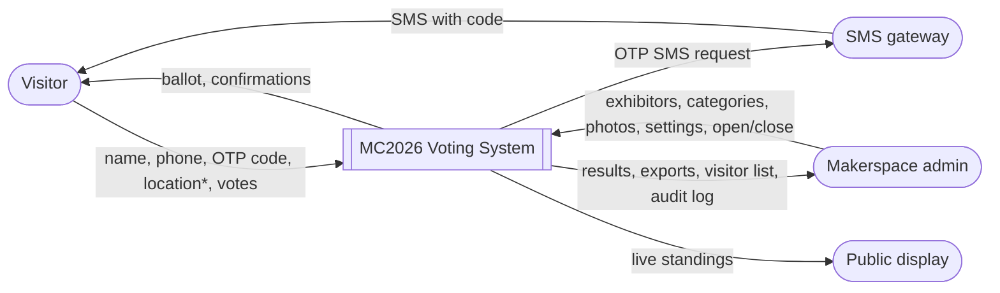
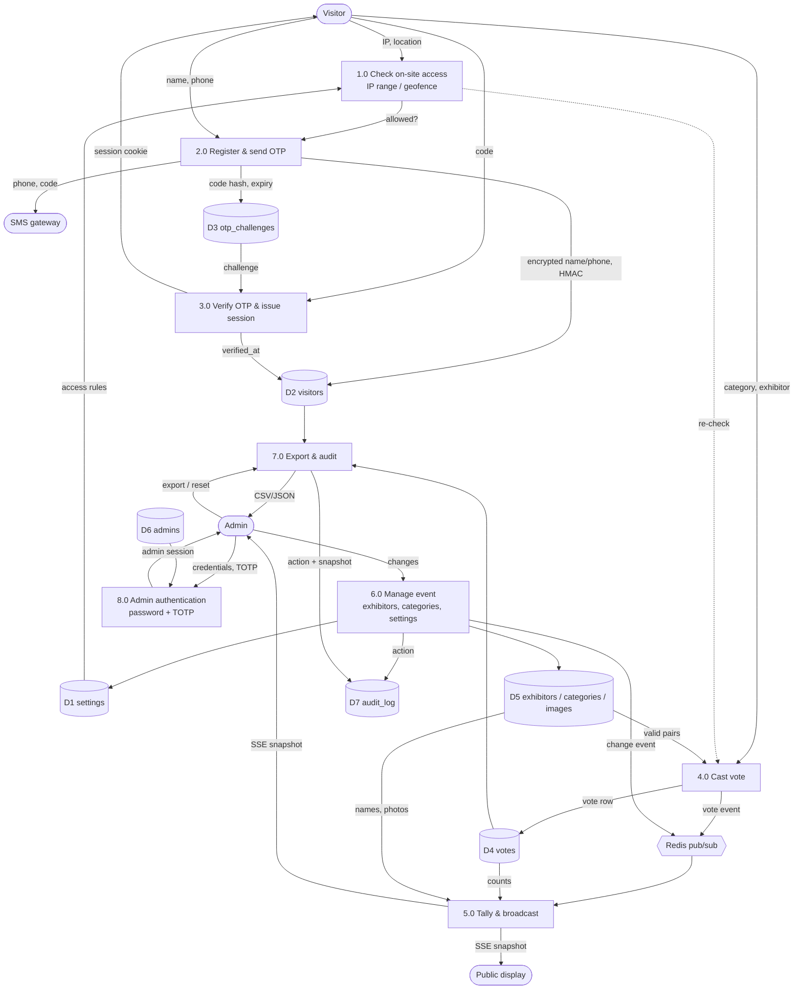

# Data Flow Diagrams

## Level 0 — Context

\* location only when the visitor is not on the venue network and the rules allow geofencing.

## Level 1 — Processes and data stores

## Personal-data flow (privacy view)

| Data | Collected at | Stored as | Who can read it | Leaves the system via |
|---|---|---|---|---|
| Name | 2.0 | AES-256-GCM ciphertext (`visitors.name_enc`) | Admins (decrypted in admin API only) | Visitors CSV export (audited) |
| Phone | 2.0 | AES-256-GCM ciphertext + HMAC lookup key + last 4 digits | Admins: masked in UI, full in export (audited) | SMS gateway (to send the OTP); visitors CSV |
| OTP code | 2.0 | HMAC only, never plaintext; 5-min TTL | Nobody | SMS to the visitor |
| Location | 1.0 / 4.0 | lat/lng on the vote row (fraud review) | Admins via DB | — |
| IP address | every request | on visitor + vote rows, audit log | Admins via DB | — |
| Outreach consent | 2.0 | boolean | Admins | "Export (opted-in only)" |
