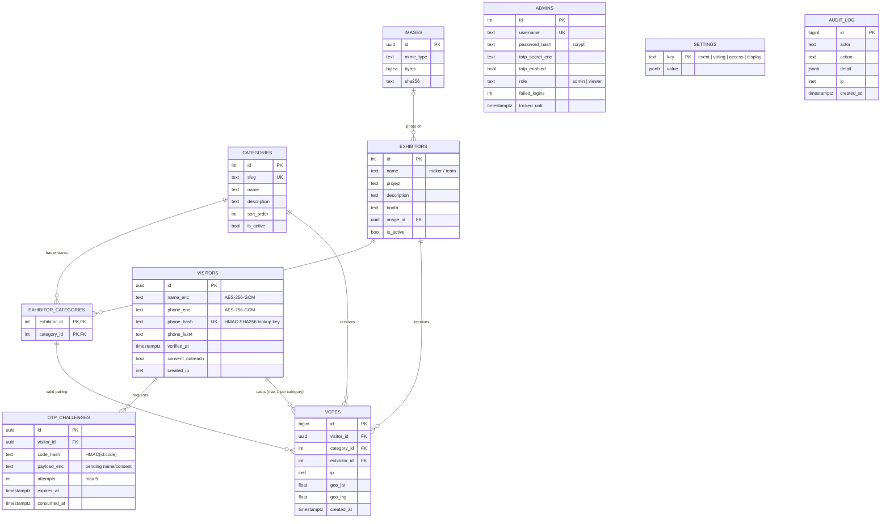

# Entity–Relationship Diagram

TypeORM entities live in `backend/src/database/entities/`; the schema itself is created by the SQL migration in `backend/src/database/migrations/`.

## Integrity rules enforced by the database

| Rule | Constraint |
|---|---|
| One vote per visitor per category (F12) | `UNIQUE (visitor_id, category_id)` on `votes` |
| A vote must name an exhibitor that is actually in that category | composite FK `votes(exhibitor_id, category_id) → exhibitor_categories` |
| One visitor record per phone number | `UNIQUE (phone_hash)` on `visitors` |
| Unique usernames / category slugs | `UNIQUE` constraints |
| Tally speed | index `votes (category_id, exhibitor_id)` |

Because these rules live in PostgreSQL rather than in application code, they hold even under concurrent double-taps, multiple replicas and replayed requests (covered by `test/api.test.js` → "concurrent double-submits").

## `settings` documents

| key | shape |
|---|---|
| `event` | `{ name, tagline, venue }` |
| `voting` | `{ open: bool, opens_at: ISO?, closes_at: ISO? }` |
| `access` | `{ mode: off\|ip\|geo\|ip_or_geo\|ip_and_geo, allowed_cidrs: string[], geofence: { lat, lng, radius_m, max_accuracy_m } }` |
| `display` | `{ key: string, show_counts: bool }` |
