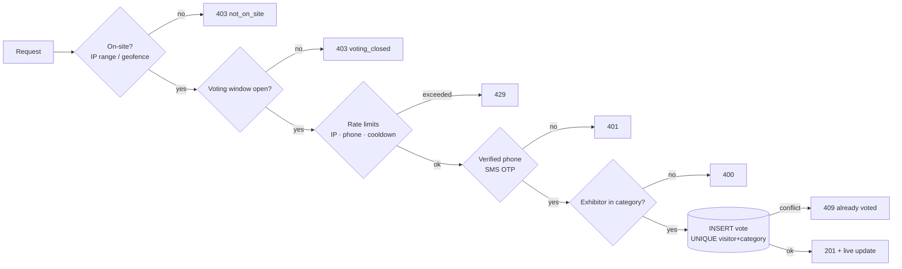

# Security: authentication, authorization, anti-fraud and privacy

## 1. Authentication

| Actor | How they authenticate | Session |
|---|---|---|
| **Visitor** | Name + mobile number, then a 6-digit **SMS OTP** (no password, F5/F6) | `mc_v` cookie — HS256 JWT, HttpOnly, SameSite=Strict, Secure (prod), 12 h |
| **Admin** | Username + password (scrypt N=16384), then **TOTP** (RFC 6238) if enrolled | `mc_ap` pre-MFA cookie (5 min, cannot call any API) → `mc_a` session cookie, 8 h |
| **Public display (TV)** | Secret display key from the admin console link/QR, exchanged once for a cookie; key removed from the URL bar | `mc_d` cookie, 24 hours, bound to the current key |

### OTP details
- 6 random digits (`crypto.randomInt`), valid **5 minutes**, **single use**, max **5 wrong attempts** then the challenge locks.
- Only `HMAC-SHA256(challengeId:code)` is stored; compared in constant time; row locked `FOR UPDATE` during verification (no parallel guessing).
- Requesting a new code invalidates earlier unused codes for that phone.
- Abuse limits: 30 s resend cooldown and 5 codes/hour **per phone**; 20 requests/10 min **per IP**; 60 verify attempts/10 min per IP. Limits are shared across replicas via Redis.
- The visitor's name only replaces the stored name after successful verification, so nobody can rename someone else's record by typing their number.

### Admin login hardening
- Constant-time behaviour whether or not the username exists (dummy scrypt).
- Account lock for 15 min after 5 failed passwords; 10 attempts / 5 min per IP.
- Session tokens carry a *token version* derived from the password hash: **changing the password logs out every other session**.
- TOTP enrolment requires proving a valid code; disabling requires password + current code.
- Every login, failure, MFA change, export, reset, settings change and CRUD action is written to `audit_log`.

## 2. Authorization

| Capability | Visitor (verified) | Display | Viewer | Admin |
|---|:-:|:-:|:-:|:-:|
| See ballot (categories, exhibitors) | ✓ (also anonymous) | | ✓ | ✓ |
| Request/verify OTP | on-site only | | | |
| Cast vote | own, 1 per category, on-site, while open | | | |
| Live results stream | | ✓ | ✓ | ✓ |
| Results & export (CSV/JSON) | | | ✓ | ✓ |
| Manage exhibitors / categories / photos | | | | ✓ |
| Open/close voting, schedule, access rules, event details | | | | ✓ |
| Reset results / purge visitors | | | | ✓ (type RESET) |
| Visitor list & PII export | | | | ✓ |
| Manage admin users, rotate display key, audit log | | | | ✓ |

Enforced server-side by NestJS guards — `VisitorGuard`, `DisplayOrAdminGuard` and `AdminGuard` with the `@Roles('admin')` decorator — plus a global `ValidationPipe` (class-validator DTOs, unknown fields stripped). The UI hiding buttons is cosmetic only; the e2e tests prove a viewer gets 403 on writes.

## 3. Anti-fraud layers (defence in depth)

1. **On-site restriction (F11).** Two independent signals, combined by an admin-selected mode:
   - *IP range* — the venue Wi-Fi's public IP/CIDR as observed by the server. Hard to spoof; `TRUST_PROXY` makes sure only the real proxy hop's `X-Forwarded-For` is trusted, and nginx overwrites (never appends) the header.
   - *Geofence* — browser Geolocation inside a radius around the venue, with a maximum accuracy threshold. Covers visitors on mobile data; it is client-reported and therefore weaker, which is why it is always combined with OTP + per-phone limits. Location is stored on each vote for after-the-fact review.
   - Modes: `ip_or_geo` (recommended), `ip`, `geo`, `ip_and_geo`, `off` (testing). Checked at OTP request **and again at every vote**.
2. **One person = one phone = one ballot (F12).** The phone number is normalised (Jordanian local formats, `+962`, `00962`, Arabic digits) before hashing, so `079…`, `+96279…` and `٠٧٩…` are the same voter. `UNIQUE(phone_hash)` + `UNIQUE(visitor_id, category_id)` make duplicates impossible even under concurrency.
3. **Voting window (F10).** Manual open/close plus optional schedule, enforced server-side on every OTP request and vote.
4. **Integrity of the ballot.** Composite foreign key ensures votes only go to exhibitors entered in that category; inactive exhibitors/categories are rejected.
5. **Auditability.** IP + location per vote, audit log of every admin action, reset keeps a snapshot of the wiped counts.

Residual risks (honest list for the pitch Q&A): a person with several SIM cards can vote several times (mitigation: per-IP soft limits, post-event review of IP/location clusters); geolocation can be spoofed with developer tools (mitigation: prefer `ip` mode when the venue Wi-Fi is reliable, or `ip_and_geo`); SMS pumping costs (mitigated by per-phone and per-IP caps and Jordan-only number validation).

## 4. Privacy & data protection (F14)

- Name and phone are encrypted with **AES-256-GCM** (random IV, authenticated) before they reach the database. Lookups use an **HMAC-SHA256** of the phone with a separate key, so the database never contains a searchable plaintext number.
- Keys are derived with **HKDF** from one `APP_SECRET` (separate keys for JWT, encryption, phone HMAC, OTP HMAC). Store it in a secrets manager; never in git.
- The admin UI shows phones masked (`•••• 4567`); full numbers appear only in the CSV export, which is admin-only and audited. A separate "opted-in only" export supports the outreach use case.
- Visitors see a plain-language privacy note and an explicit, unticked consent box for future outreach.
- Purge: admins can delete all visitor records after the event.
- CSV exports neutralise spreadsheet formula injection (`=`, `+`, `-`, `@`).

## 5. Web security baseline

- `helmet` security headers, strict **Content-Security-Policy** (no inline scripts, `frame-ancestors 'none'`), HSTS in production.
- CSRF: SameSite=Strict cookies **plus** a required `X-Requested-With: mc2026` header on every state-changing API call.
- Input validation and length caps on every field; JSON body limit 50 kB; image uploads ≤ 3 MB with **magic-byte** checks (JPEG/PNG/WebP only), served with `nosniff`.
- Parameterised SQL everywhere (no string-built queries with user input).
- No secrets in the client; OTP echo for demos is hard-disabled when `NODE_ENV=production`.

## 6. Before the live pilot — checklist

- [ ] Strong `APP_SECRET` and `ADMIN_PASSWORD`; TLS certificate installed; `COOKIE_SECURE=true`
- [ ] Every admin has enrolled TOTP (Security page shows status for the whole team)
- [ ] Access mode set to `ip_or_geo` or `ip`; venue public IP range entered and tested from a phone on the Wi-Fi; geofence centred on the venue
- [ ] SMS provider configured and a real OTP received
- [ ] Rehearsal votes reset (Results → Reset) and visitor records purged if needed
- [ ] Display key rotated after the rehearsal
